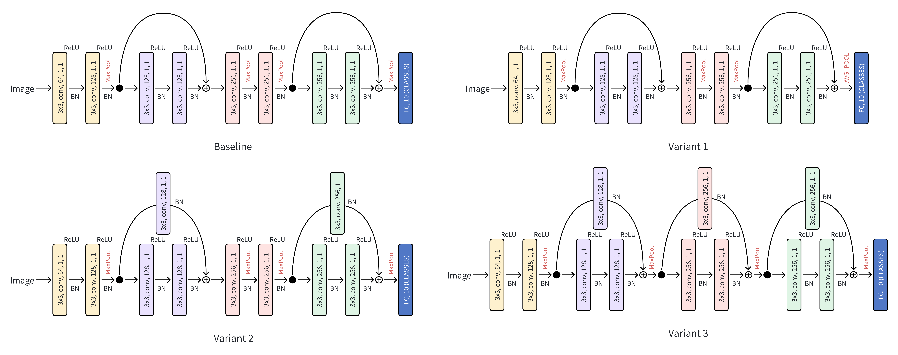

# CuPy and NumPy Implemention of ResNet-9

## 1. Architecture
<div align=left></div>

## 2. Implementing Optimization (Cupy)
### 2.1 Convolution
Suppose the shape of the input tensor is $$(N, C_{\text{in}}, H, W)$$, and the shape of the kernel is $$(C_{\text{out}}, C_{\text{in}}, K, K)$$, strid is $$S$$, so the shape of the output is $$(N, C_{\text{out}}, H', W')$$. The time complexity is $$O(N \cdot C_{\text{out}} \cdot H' \cdot W' \cdot C_{\text{in}} \cdot K^2)$$.
The NumPy implementation iteratively extracts patches from the input tensor, performs element-wise multiplication with the convolution kernel for each patch, and then sums the results.

### 2.2 Max Pooling
Suppose the shape of the input tensor is $$(N, C, H, W)$$, and the shape of the pooling kernel is $$(K, K)$$, strid is $$S$$, so the shape of the output tensor is $$(N, C, H', W')$$. The time complexity is $$O(N \cdot C \cdot H' \cdot W' \cdot K^2)$$.
In Numpy implementation, max pooling also uses nested loops to extract patches from the input tensor, and find the min and max values for each patch, which is also not efficient.
In Cupy implementation, we use the as_strided method to create a view of the input tensor, eliminating the need for nested loops in the convolution and pooling process. Though theoritical time complexity is remains the same, it significantly improves computational efficiency because of applying Cupy's parallelism.

## 3. Training
```train
python train.py
```

**Optimizer:** We implemented ResNet9 [1] with two kinds of optimizer, SGD and Adam [2].
**Training Set:** MNIST-train (60,000 images) [3]
**Test Set:** MNIST-test (10,000 images)

Hyperparameter | Value
| :----: | :----: |
epoch | 8
batch_size | 8
stride | 1
dilate | 1
learning_rate | 1e-3
(beta1, beta2) | (0.9, 0.999)

### 3.1 Implementation of the Adam Optimizer:

1. Update m, v in each iteration:

   $$m_t = \beta_1 m_{t-1} + (1-\beta_1)g_t$$ &nbsp;&nbsp;&nbsp;&nbsp; $$v_t = \beta_2 v_{t-1} + (1-\beta_2){g_t}^2$$

   ```Python
   # Initialize m and v
   self.m, self.v = cp.zeros_like(self.param), cp.zeros_like(self.param)

   # Update m, v in each iteration
   self.m += (1 - beta1) * (diff - self.m)
   self.v += (1 - beta2) * (diff**2 - self.v)
   ```

3. Bias Correction:

   $${lr}_t = {lr}_0 * \frac{\sqrt{1 - {\beta_2}^i}}{1 - {\beta_1}^i}$$

   ```python
   # Bias Correction
   lr_t  = self.lr * cp.sqrt(1.0 - self.beta2**self.iter) / (1.0 - self.beta1**self.iter)
   ```
   
4. Update the network parameters:

   $${\theta}_{t+1} = {\theta}_t - \frac{lr_t}{\sqrt{v_t}+\epsilon}m_t$$

   ```python
   # Update the network parameters
   self.param -= lr * self.m / (cp.sqrt(self.v) + 1e-7)
   ```

### 3.2 Training Loss
<div align=left></div>

## 4. Performance Results
### 4.1 Accuracy
#### 4.1.1 Comparison with the Official Implementation

| | Training Set Acc. | Test-set Acc.
| :----: | :----: | :----: |
Official PyTorch Implementation | 99.67 | 99.38
Our CuPy Implementation (SGD) | 99.46 | 99.21
Our CuPy Implementation (Adam) | 99.65 | 99.43

#### 4.1.2 Ablation Study

<div align=left></div>

It is observed that modifications to the residual module did not lead to significant improvements in the results. However, replacing the max pooling layer before the FC layer with a global average pooling layer yielded a more noticeable improvement. Additionally, using the Adam optimizer, compared to a simple SGD, also brought a considerable enhancement.

| | Network Architecture (Optimizer) | Test-set Acc.
| :----: | :----: | :----: |
Baseline | Add residual directly - 2 ResBlock - MaxPooling (SGD) | 99.21
Variant 1 | Add residual directly - 2 ResBlock - AvgPooling (SGD) | 99.46
Variant 2 | Add residual  through a Conv layer - 2 ResBlock - MaxPooling (SGD) | 99.19
Variant 3 | Add residual  through a Conv layer - 3 ResBlock - MaxPooling (SGD) | 99.20
Variant 4 | Add residual  directly - 2 ResBlock - MaxPooling (Adam) | 99.43

### 4.2 Efficiency
Experimental Settings:
- CPU: 11th Gen Intel(R) Core(TM) i9-11950H @ 2.60GHz   2.61 GHz
- GPU: NVIDIA H800 (80G) * 1

Method | NumPy Implementation | CuPy Implemetation | Official PyTorch
| :----: | :----: | :----: | :----: |
Time | 48,994.08s | 1508.85s | 203.93s

Our CuPy implementation achieves 30x acceleration than the NumPy implementation.


## References

[1] Kaiming H, Zhang X, Ren S, and Sun J. (2016). Deep Residual Learning for Image Recognition. Conference on Computer Vision and Pattern Recognition (CVPR).

[2] Kingma D P. Adam: A method for stochastic optimization[J]. arXiv preprint arXiv:1412.6980, 2014.

[3] LeCun Y, Bottou L, Bengio Y, et al. Gradient-based learning applied to document recognition[J]. Proceedings of the IEEE, 1998, 86(11): 2278-2324.
